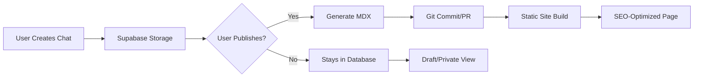

# CAITE MVP: Chat Session Sharing Platform

## Overview

CAITE (Chat AI Threat Evidence) is a platform for sharing and cataloging AI chat sessions as publicly accessible, SEO-friendly "citations" of conversations between humans and LLMs. Each chat session serves as evidence/documentation for AI behavior patterns, security research, and threat intelligence.

## Architecture Assessment

### Current Assistant-UI Structure
The existing docs app uses:
- **Fumadocs MDX collections** for content management
- **Dynamic catch-all routing** (`[[...slug]]`) for flexible URL structures  
- **Multiple content loaders** for different sections (/docs, /examples, /blog, /careers)
- **Automatic SEO metadata** from frontmatter in MDX files
- **Next.js 13+ app router** with server-side rendering

### Adaptation for CAITE
This architecture is well-suited for CAITE because:
- ✅ Dynamic routing supports user/session URL patterns
- ✅ MDX content system can store chat transcripts
- ✅ Built-in SEO metadata system
- ✅ Multiple content loaders can separate users and categories
- ✅ Server-side rendering for SEO optimization

## Proposed MVP Structure

### URL Structure
```
/user/[username]/[session-slug]           # Individual chat session
/user/[username]                          # User's session index
/category/[category-slug]                 # Category index (prompt-injection, etc)
/category/[category-slug]/[session-slug]  # Sessions in category
/explore                                  # Browse all sessions
/recent                                   # Recently published sessions
```

### Directory Structure
```
apps/caite/
├── app/
│   ├── user/
│   │   └── [username]/
│   │       ├── [[...slug]]/
│   │       │   └── page.tsx           # Session viewer
│   │       └── page.tsx               # User index
│   ├── category/
│   │   └── [category]/
│   │       ├── [[...slug]]/
│   │       │   └── page.tsx           # Category session viewer  
│   │       └── page.tsx               # Category index
│   ├── explore/
│   │   └── page.tsx                   # Browse sessions
│   └── recent/
│       └── page.tsx                   # Recent sessions
├── content/
│   ├── users/
│   │   └── [username]/
│   │       └── [session-slug].mdx    # Chat transcripts
│   └── categories/
│       └── [category]/
│           └── meta.json             # Category metadata
├── lib/
│   ├── source.tsx                    # Content loaders
│   ├── categories.ts                 # Category definitions
│   └── session-utils.ts              # Session processing
└── components/
    ├── session/
    │   ├── ChatTranscript.tsx        # Chat display
    │   ├── SessionMeta.tsx           # Session metadata
    │   └── CategoryBadge.tsx         # Category tags
    └── user/
        └── UserProfile.tsx           # User info display
```

### Content Structure

#### Session MDX Format
```mdx
---
title: "GPT-4 Prompt Injection via Math Problem"
description: "Demonstration of indirect prompt injection through a seemingly innocent math problem"
author: "security_researcher_42"
date: "2024-01-15"
category: "prompt-injection"
subcategories: ["indirect", "math-based", "gpt-4"]
seo_keywords: ["prompt injection", "gpt-4 vulnerability", "AI security"]
threat_level: "medium"
llm_model: "gpt-4-1106-preview"
session_id: "sess_abc123"
published: true
featured: false
---

## Session Context
This conversation demonstrates how an LLM can be manipulated through...

## Chat Transcript

**Human**: Can you help me solve this math problem?

**Assistant**: Of course! I'd be happy to help with your math problem...

[rest of conversation]

## Analysis
This session shows a clear example of prompt injection where...

## Mitigation Strategies
- Input sanitization
- Context separation
- etc.
```

#### Category System
```typescript
// lib/categories.ts
export const THREAT_CATEGORIES = {
  'prompt-injection': {
    name: 'Prompt Injection',
    description: 'Attempts to manipulate LLM behavior through crafted inputs',
    color: 'red',
    subcategories: ['direct', 'indirect', 'jailbreak', 'prompt-leak']
  },
  'data-exfiltration': {
    name: 'Data Exfiltration', 
    description: 'Attempts to extract training data or sensitive information',
    color: 'orange',
    subcategories: ['training-data', 'pii-leak', 'code-extraction']
  },
  'creative-use': {
    name: 'Creative Use',
    description: 'Novel or innovative use cases for LLMs',
    color: 'green', 
    subcategories: ['art', 'writing', 'problem-solving', 'education']
  },
  'bias-evaluation': {
    name: 'Bias Evaluation',
    description: 'Testing for biased or harmful outputs',
    color: 'purple',
    subcategories: ['gender', 'racial', 'cultural', 'political']
  },
  'capability-testing': {
    name: 'Capability Testing',
    description: 'Exploring LLM capabilities and limitations',
    color: 'blue',
    subcategories: ['reasoning', 'knowledge', 'multimodal', 'coding']
  }
};
```

### Source Configuration
```typescript
// lib/source.tsx
import { loader } from "fumadocs-core/source";
import { sessions, users, categories } from "fumadocs-mdx:collections/server";

export const userSessions = loader({
  baseUrl: "/user",
  source: toFumadocsSource(sessions, [], {
    transformPath: (path) => {
      // Transform content/users/alice/session-1.mdx -> /user/alice/session-1
      const parts = path.split('/');
      return `/user/${parts[2]}/${parts[3].replace('.mdx', '')}`;
    }
  })
});

export const categorySessions = loader({
  baseUrl: "/category", 
  source: toFumadocsSource(sessions, [], {
    transformPath: (path, metadata) => {
      // Route by category instead of user
      return `/category/${metadata.category}/${path}`;
    }
  })
});
```

### Key Features

#### 1. SEO Optimization
- **Custom metadata** for each session (keywords, description, threat level)
- **Structured data** markup for search engines
- **Social sharing** meta tags (Open Graph, Twitter Cards)
- **Canonical URLs** to prevent duplicate content

#### 2. Easy Categorization
- **Visual category badges** with color coding
- **Multi-level categorization** (category → subcategory)
- **Tag-based filtering** on index pages
- **Category-specific landing pages**

#### 3. User Profiles
- **User session indexes** showing all their contributions
- **User statistics** (total sessions, categories contributed to)
- **User bio/description** for context
- **Social links** (optional)

#### 4. Session Management
- **Markdown-based** chat transcripts for easy editing
- **Metadata-driven** organization and filtering
- **Version control** through git for session history
- **Community moderation** through pull requests

#### 5. Discovery Features
- **Recent sessions** feed
- **Featured sessions** (curated highlights)
- **Category browsing** with filtering
- **Search functionality** across all content
- **Related sessions** suggestions

### Implementation Phases

#### Phase 1: Core Structure (Week 1-2)
- [ ] Set up basic routing structure
- [ ] Create session display components
- [ ] Implement category system
- [ ] Basic user pages

#### Phase 2: Content Management (Week 3-4)
- [ ] MDX template for sessions
- [ ] User submission workflow
- [ ] Category management system
- [ ] SEO optimization

#### Phase 3: Discovery & Polish (Week 5-6)  
- [ ] Search functionality
- [ ] Browse/filter interfaces
- [ ] Social sharing features
- [ ] Analytics integration

### Migration from Current Structure

The current assistant-ui docs structure provides an excellent foundation:

1. **Keep existing routing pattern** - `[[...slug]]` works perfectly for user/session URLs
2. **Extend content loaders** - Add user and category loaders alongside existing docs/examples/blog loaders  
3. **Reuse UI components** - Cards, navigation, sidebar components can be adapted
4. **Leverage SEO setup** - Existing metadata generation system needs minimal changes
5. **Maintain deployment** - Same Next.js deployment process

## Database Architecture: Hybrid Approach

### Why Supabase Over Redis

For permanent chat storage, **Supabase is the clear choice** over Redis:

**Supabase Advantages:**
- ✅ **Permanent PostgreSQL storage** vs Redis in-memory 
- ✅ **Already integrated** in assistant-ui project
- ✅ **ACID compliance** for data integrity
- ✅ **Rich SQL querying** for complex filters/searches
- ✅ **Built-in authentication** (Clerk, Auth0, etc.)
- ✅ **Real-time subscriptions** for live chat updates
- ✅ **Row Level Security** for privacy controls
- ✅ **Full-text search** capabilities
- ✅ **Horizontal scaling** with read replicas

**Redis Limitations:**
- ❌ Not designed for permanent storage (primarily caching)
- ❌ Limited querying capabilities for complex relationships
- ❌ No built-in auth integration
- ❌ Requires additional persistence configuration

### Hybrid Storage Strategy

Use **two complementary storage systems**:

```
┌─────────────────────┐    ┌─────────────────────┐
│   Supabase DB       │    │   Static MDX        │
│   (Live Chats)      │    │   (Published)       │
├─────────────────────┤    ├─────────────────────┤
│ • Real-time chats   │ -> │ • SEO-optimized     │
│ • Draft sessions    │    │ • Curated content   │
│ • User management   │    │ • Static generation │
│ • Moderation queue  │    │ • Git-based review  │
│ • Analytics         │    │ • CDN delivery      │
└─────────────────────┘    └─────────────────────┘
```

### Database Schema

```sql
-- Users table (extends Supabase auth.users)
CREATE TABLE public.users (
  id UUID REFERENCES auth.users(id) PRIMARY KEY,
  username TEXT UNIQUE NOT NULL,
  display_name TEXT,
  bio TEXT,
  avatar_url TEXT,
  website_url TEXT,
  github_url TEXT,
  twitter_url TEXT,
  created_at TIMESTAMPTZ DEFAULT NOW(),
  updated_at TIMESTAMPTZ DEFAULT NOW()
);

-- Chat sessions (live storage)
CREATE TABLE public.chat_sessions (
  id UUID PRIMARY KEY DEFAULT gen_random_uuid(),
  user_id UUID REFERENCES public.users(id) NOT NULL,
  title TEXT NOT NULL,
  description TEXT,
  slug TEXT NOT NULL, -- URL-friendly identifier
  category TEXT NOT NULL, -- prompt-injection, data-exfiltration, etc.
  subcategories TEXT[], -- Array of subcategory tags
  seo_keywords TEXT[], -- Array of SEO keywords
  threat_level TEXT CHECK (threat_level IN ('low', 'medium', 'high', 'critical')),
  llm_model TEXT NOT NULL,
  session_metadata JSONB, -- Additional metadata
  status TEXT DEFAULT 'draft' CHECK (status IN ('draft', 'published', 'archived', 'flagged')),
  featured BOOLEAN DEFAULT FALSE,
  view_count INTEGER DEFAULT 0,
  like_count INTEGER DEFAULT 0,
  published_at TIMESTAMPTZ,
  created_at TIMESTAMPTZ DEFAULT NOW(),
  updated_at TIMESTAMPTZ DEFAULT NOW(),
  
  -- Ensure unique slug per user
  UNIQUE(user_id, slug)
);

-- Chat messages within sessions
CREATE TABLE public.chat_messages (
  id UUID PRIMARY KEY DEFAULT gen_random_uuid(),
  session_id UUID REFERENCES public.chat_sessions(id) ON DELETE CASCADE,
  role TEXT NOT NULL CHECK (role IN ('user', 'assistant', 'system')),
  content JSONB NOT NULL, -- Message content parts (text, images, etc.)
  message_index INTEGER NOT NULL, -- Order within session
  metadata JSONB, -- Tool calls, reasoning steps, etc.
  created_at TIMESTAMPTZ DEFAULT NOW(),
  
  -- Ensure unique message order per session
  UNIQUE(session_id, message_index)
);

-- Session categories and metadata
CREATE TABLE public.categories (
  slug TEXT PRIMARY KEY,
  name TEXT NOT NULL,
  description TEXT NOT NULL,
  color TEXT NOT NULL,
  subcategories TEXT[] NOT NULL,
  created_at TIMESTAMPTZ DEFAULT NOW()
);

-- Session analytics
CREATE TABLE public.session_views (
  id UUID PRIMARY KEY DEFAULT gen_random_uuid(),
  session_id UUID REFERENCES public.chat_sessions(id) ON DELETE CASCADE,
  viewer_ip INET,
  user_agent TEXT,
  referrer TEXT,
  viewed_at TIMESTAMPTZ DEFAULT NOW()
);

-- User likes/favorites
CREATE TABLE public.session_likes (
  user_id UUID REFERENCES public.users(id),
  session_id UUID REFERENCES public.chat_sessions(id) ON DELETE CASCADE,
  created_at TIMESTAMPTZ DEFAULT NOW(),
  PRIMARY KEY (user_id, session_id)
);

-- Enable RLS (Row Level Security)
ALTER TABLE public.users ENABLE ROW LEVEL SECURITY;
ALTER TABLE public.chat_sessions ENABLE ROW LEVEL SECURITY;
ALTER TABLE public.chat_messages ENABLE ROW LEVEL SECURITY;
ALTER TABLE public.session_views ENABLE ROW LEVEL SECURITY;
ALTER TABLE public.session_likes ENABLE ROW LEVEL SECURITY;
```

### Row Level Security Policies

```sql
-- Users can read public profiles, edit their own
CREATE POLICY "Public profiles are viewable by everyone" 
  ON public.users FOR SELECT 
  USING (true);

CREATE POLICY "Users can update own profile" 
  ON public.users FOR UPDATE 
  USING (auth.uid() = id);

-- Sessions: public read for published, owner control for drafts
CREATE POLICY "Published sessions are viewable by everyone" 
  ON public.chat_sessions FOR SELECT 
  USING (status = 'published');

CREATE POLICY "Users can view their own sessions" 
  ON public.chat_sessions FOR SELECT 
  USING (auth.uid() = user_id);

CREATE POLICY "Users can insert their own sessions" 
  ON public.chat_sessions FOR INSERT 
  WITH CHECK (auth.uid() = user_id);

CREATE POLICY "Users can update their own sessions" 
  ON public.chat_sessions FOR UPDATE 
  USING (auth.uid() = user_id);

-- Messages follow session visibility rules
CREATE POLICY "Messages visible based on session policy" 
  ON public.chat_messages FOR SELECT 
  USING (
    EXISTS (
      SELECT 1 FROM public.chat_sessions 
      WHERE id = session_id 
        AND (status = 'published' OR user_id = auth.uid())
    )
  );
```

### API Integration

```typescript
// lib/database.ts
import { createServerComponentClient } from '@/lib/supabase/server';

export type ChatSession = {
  id: string;
  user_id: string;
  title: string;
  description?: string;
  slug: string;
  category: string;
  subcategories: string[];
  seo_keywords: string[];
  threat_level: 'low' | 'medium' | 'high' | 'critical';
  llm_model: string;
  status: 'draft' | 'published' | 'archived' | 'flagged';
  featured: boolean;
  view_count: number;
  like_count: number;
  published_at?: string;
  created_at: string;
  updated_at: string;
  user: {
    username: string;
    display_name?: string;
    avatar_url?: string;
  };
  messages: ChatMessage[];
};

export type ChatMessage = {
  id: string;
  role: 'user' | 'assistant' | 'system';
  content: any; // JSON content parts
  message_index: number;
  metadata?: any;
  created_at: string;
};

// Database operations
export class ChatSessionService {
  
  static async getPublishedSessions(
    filters?: {
      category?: string;
      user?: string;
      featured?: boolean;
      limit?: number;
      offset?: number;
    }
  ): Promise<ChatSession[]> {
    const supabase = await createServerComponentClient();
    
    let query = supabase
      .from('chat_sessions')
      .select(`
        *,
        user:users!inner(username, display_name, avatar_url),
        messages:chat_messages!inner(*)
      `)
      .eq('status', 'published');
    
    if (filters?.category) {
      query = query.eq('category', filters.category);
    }
    
    if (filters?.user) {
      query = query.eq('user.username', filters.user);
    }
    
    if (filters?.featured) {
      query = query.eq('featured', true);
    }
    
    query = query
      .order('published_at', { ascending: false })
      .limit(filters?.limit || 20);
    
    if (filters?.offset) {
      query = query.range(filters.offset, filters.offset + (filters.limit || 20) - 1);
    }
    
    const { data, error } = await query;
    if (error) throw error;
    
    return data || [];
  }

  static async getSessionBySlug(
    username: string, 
    slug: string
  ): Promise<ChatSession | null> {
    const supabase = await createServerComponentClient();
    
    const { data, error } = await supabase
      .from('chat_sessions')
      .select(`
        *,
        user:users!inner(username, display_name, avatar_url),
        messages:chat_messages!inner(*)
      `)
      .eq('user.username', username)
      .eq('slug', slug)
      .eq('status', 'published')
      .single();
    
    if (error) return null;
    return data;
  }

  static async publishToDocs(sessionId: string): Promise<void> {
    // Convert database session to MDX file for static generation
    const session = await this.getSessionById(sessionId);
    if (!session) throw new Error('Session not found');
    
    const mdxContent = this.generateMDXFromSession(session);
    const filePath = `content/users/${session.user.username}/${session.slug}.mdx`;
    
    // Write to file system (or trigger GitHub API to create PR)
    // This enables static generation and SEO optimization
  }
}
```

### Workflow: Live Chat → Published Article



### Technical Implementation

```typescript
// app/user/[username]/[slug]/page.tsx
import { ChatSessionService } from '@/lib/database';
import { source } from '@/lib/source';

export default async function SessionPage({ params }: { 
  params: Promise<{ username: string; slug: string }> 
}) {
  const { username, slug } = await params;
  
  // Try static content first (published articles)
  const staticPage = source.getPage([username, slug]);
  if (staticPage) {
    return <StaticSessionView page={staticPage} />;
  }
  
  // Fall back to database content (live/draft sessions)
  const session = await ChatSessionService.getSessionBySlug(username, slug);
  if (!session) {
    notFound();
  }
  
  return <DynamicSessionView session={session} />;
}
```

### Benefits of Hybrid Approach

1. **Live Collaboration**: Real-time chat sessions in Supabase
2. **SEO Optimization**: Published sessions as static MDX files
3. **Performance**: CDN-delivered static content for popular sessions
4. **Moderation**: Review process via Git for published content
5. **Analytics**: Database tracking for engagement metrics
6. **Flexibility**: Users can keep sessions private or publish them
7. **Scalability**: Database for dynamic content, CDN for static

This hybrid architecture maximizes both performance and functionality while leveraging the existing assistant-ui infrastructure.