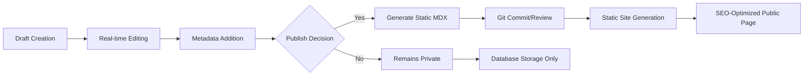

# CAITE Technical Charter
**Chat AI Threat Evidence Platform**

*Version 1.0 | December 2024*

---

## Executive Summary

CAITE (Chat AI Threat Evidence) is a next-generation platform for documenting, sharing, and analyzing AI chat sessions as publicly accessible threat intelligence. Built on the robust assistant-ui foundation, CAITE transforms conversational AI interactions into SEO-optimized, citable evidence for security research and community knowledge sharing.

**Core Mission**: Create the definitive repository of AI threat intelligence through real chat session documentation, enabling researchers to catalog, analyze, and share evidence of AI vulnerabilities, capabilities, and behaviors.

---

## Project Vision & Scope

### 🎯 Primary Objectives

1. **Knowledge Repository**: Build the largest public database of documented AI chat sessions categorized by threat type and research significance

2. **SEO-Optimized Citations**: Transform chat conversations into discoverable, linkable evidence that researchers can reference in papers, reports, and discussions

3. **Community Platform**: Foster a research community where security professionals can collaborate on AI threat intelligence through shared documentation

4. **Research Infrastructure**: Provide tools and APIs for academic and industry research into AI safety, security, and capabilities

### 🔬 Target Use Cases

**Primary Users:**
- **Security Researchers**: Document prompt injection techniques, jailbreaks, data exfiltration attempts
- **AI Safety Researchers**: Catalog bias instances, capability limitations, hallucinations
- **Academic Researchers**: Create citable evidence for papers on AI behavior and safety
- **Industry Professionals**: Share threat intelligence and mitigation strategies

**Core Workflows:**
1. **Documentation**: Researchers upload chat sessions with metadata and analysis
2. **Categorization**: Sessions tagged by threat type (prompt injection, bias, etc.)
3. **Discovery**: Public browsing and searching of published threat intelligence
4. **Citation**: SEO-friendly URLs for academic and professional reference
5. **Analysis**: Community discussion and expert validation of findings

---

## Technical Architecture

### 🏗️ Foundation: Assistant-UI Integration

**Built Upon**: Existing assistant-ui monorepo architecture
- **Leverages**: Proven Next.js + Supabase + Fumadocs stack
- **Extends**: Current routing and content management patterns
- **Integrates**: Existing authentication and UI component library

### 🗄️ Database Architecture: Hybrid Approach

**Two-Tier Storage Strategy**:

```
┌─────────────────────┐    ┌─────────────────────┐
│   Supabase DB       │    │   Static MDX        │
│   (Live Sessions)   │ -> │   (Published)       │
├─────────────────────┤    ├─────────────────────┤
│ • Real-time editing │    │ • SEO optimization  │
│ • Draft management  │    │ • CDN performance   │
│ • User collaboration│    │ • Git-based review  │
│ • Analytics tracking│    │ • Search indexing   │
└─────────────────────┘    └─────────────────────┘
```

**MVP Database Schema** (Simplified):
- **4 core tables**: users, chat_sessions, chat_messages, session_views
- **Essential features**: User profiles, session categorization, basic analytics
- **Row Level Security**: Comprehensive privacy and access controls
- **Full-text search**: PostgreSQL GIN indexes for content discovery

### 🌐 URL Structure & Routing

**SEO-Optimized Paths**:
```
/user/[username]/[session-slug]           # Individual session citation
/user/[username]                          # User's research profile
/category/[threat-type]                   # Browse by threat category
/category/[threat-type]/[session-slug]    # Category-specific view
/search?q=[query]                         # Global content search
/recent                                   # Latest published sessions
/featured                                 # Curated highlights
```

**Technical Implementation**:
- **Next.js 13+ App Router**: Dynamic catch-all routes (`[[...slug]]`)
- **Fumadocs Integration**: Existing content management system
- **Hybrid Rendering**: Database content + static MDX for published sessions

### 🔄 Content Lifecycle

**Session Journey**:


**Key Features**:
- **Draft Mode**: Private editing and collaboration
- **Publication**: Convert to static MDX for performance
- **Version Control**: Git-based review process for quality
- **Analytics**: View tracking and engagement metrics

---

## Implementation Strategy

### 📋 Phase 1: MVP Foundation (Weeks 1-4)

**Database Setup**:
- [ ] Deploy simplified schema to Supabase
- [ ] Configure Row Level Security policies
- [ ] Set up database triggers and functions
- [ ] Create seed data for threat categories

**Core Routing**:
- [ ] Implement user/session URL structure
- [ ] Create session display components
- [ ] Build category browsing interfaces
- [ ] Add basic search functionality

**User Management**:
- [ ] Extend Supabase auth with user profiles
- [ ] Username registration and validation
- [ ] Basic profile management

**Content Management**:
- [ ] Session creation and editing interface
- [ ] Draft/publish workflow
- [ ] Category assignment and tagging
- [ ] SEO metadata management

### 📈 Phase 2: Enhanced Features (Weeks 5-8)

**Static Generation**:
- [ ] MDX conversion pipeline
- [ ] Git integration for published content
- [ ] Build process optimization
- [ ] CDN deployment strategy

**Search & Discovery**:
- [ ] Advanced search with filters
- [ ] Full-text search implementation
- [ ] Category-based browsing
- [ ] Featured content curation

**Analytics**:
- [ ] View tracking implementation
- [ ] User dashboard with session metrics
- [ ] Popular content identification
- [ ] Research insights generation

**Community Features**:
- [ ] User profiles and research portfolios
- [ ] Session commenting system
- [ ] Expert verification badges
- [ ] Content moderation tools

### 🚀 Phase 3: Platform Scaling (Weeks 9-12)

**API & Integrations**:
- [ ] Public API for research access
- [ ] Export tools for academic use
- [ ] Social sharing optimization
- [ ] Third-party tool integrations

**Advanced Analytics**:
- [ ] Threat trend analysis
- [ ] Vulnerability pattern detection
- [ ] Research collaboration tools
- [ ] Citation tracking

**Performance & Security**:
- [ ] Advanced caching strategies
- [ ] Security hardening
- [ ] Compliance frameworks (GDPR, etc.)
- [ ] Backup and disaster recovery

---

## Technical Specifications

### 🛠️ Technology Stack

**Frontend**:
- **Framework**: Next.js 13+ (App Router)
- **UI Components**: Existing assistant-ui component library
- **Styling**: Tailwind CSS + existing design system
- **Documentation**: Fumadocs for content management

**Backend**:
- **Database**: Supabase (PostgreSQL)
- **Authentication**: Supabase Auth + existing integrations
- **Storage**: Supabase Storage for media assets
- **Real-time**: Supabase Realtime for live collaboration

**Infrastructure**:
- **Deployment**: Vercel (following existing pattern)
- **CDN**: Vercel Edge Network
- **Monitoring**: Existing telemetry setup
- **Analytics**: Custom implementation + Vercel Analytics

### 🔒 Security & Privacy

**Data Protection**:
- **Row Level Security**: Database-level access controls
- **User Privacy**: Configurable privacy settings
- **Content Moderation**: Community-driven reporting system
- **Audit Trails**: Comprehensive logging for security events

**Compliance**:
- **GDPR**: Right to deletion and data portability
- **Research Ethics**: Anonymous sharing options
- **Content Guidelines**: Clear policies for threat intelligence sharing

### 📊 Performance Targets

**MVP Benchmarks**:
- **Page Load**: < 2s for session pages
- **Search Response**: < 500ms for content queries
- **Database Queries**: < 100ms for common operations
- **Uptime**: 99.9% availability target

**Scalability Planning**:
- **Database**: Support for 100K+ sessions
- **Concurrent Users**: 1K+ simultaneous researchers
- **Content Growth**: 10K+ sessions annually
- **Global Performance**: Sub-3s load times worldwide

---

## Development Guidelines

### 🏛️ Architecture Principles

1. **Leverage Existing**: Build upon proven assistant-ui patterns
2. **Security First**: Implement comprehensive access controls
3. **Performance Oriented**: Optimize for research workflows
4. **Community Driven**: Enable collaborative knowledge building
5. **Research Focused**: Prioritize academic and professional use cases

### 📁 Code Organization

**Monorepo Structure**:
```
apps/caite/                 # Main CAITE application
├── app/                    # Next.js app router
│   ├── user/[username]/    # User profile and session pages
│   ├── category/           # Threat category browsing
│   ├── search/             # Global search interface
│   └── api/                # Backend API routes
├── components/             # CAITE-specific components
├── lib/                    # Database and utility functions
├── content/                # Static MDX content
└── public/                 # Static assets

packages/caite-db/          # Database schema and migrations
packages/caite-api/         # Shared API utilities
```

### 🧪 Testing Strategy

**Quality Assurance**:
- **Unit Tests**: Database functions and utility libraries
- **Integration Tests**: API endpoints and user workflows
- **E2E Tests**: Critical user journeys (session creation, publication)
- **Security Tests**: Access control and data protection validation

### 📋 Documentation Requirements

**Technical Documentation**:
- **API Documentation**: OpenAPI specifications for public endpoints
- **Database Schema**: Comprehensive field and relationship documentation
- **Deployment Guide**: Step-by-step setup instructions
- **Contributing Guidelines**: Community contribution standards

---

## Success Metrics

### 📈 Key Performance Indicators

**Content Growth**:
- **Sessions Published**: Target 1000+ quality sessions in Year 1
- **User Adoption**: 500+ registered researchers by Month 6
- **Category Coverage**: All major AI threat categories represented

**Community Engagement**:
- **Monthly Active Users**: 200+ researchers actively contributing
- **Session Views**: 10K+ monthly pageviews by Month 6
- **Citations**: Academic papers and reports referencing CAITE content

**Technical Performance**:
- **Search Quality**: High relevance scores for threat intelligence queries
- **Platform Reliability**: < 1% downtime, fast global performance
- **Data Integrity**: Zero data loss incidents

### 🎯 Success Criteria

**6-Month Goals**:
- [ ] MVP deployed with core functionality
- [ ] 100+ high-quality published sessions
- [ ] 50+ verified security researchers active
- [ ] Integration with major academic institutions

**12-Month Vision**:
- [ ] 1000+ documented threat intelligence sessions
- [ ] Recognition as authoritative AI threat evidence source
- [ ] API partnerships with security research tools
- [ ] Self-sustaining research community

---

## Risk Assessment & Mitigation

### ⚠️ Technical Risks

**Database Performance**: Large content volumes may impact query speed
- **Mitigation**: Comprehensive indexing, query optimization, caching layers

**Content Quality**: Unverified or low-quality submissions
- **Mitigation**: Expert review system, community moderation, quality guidelines

**Security Vulnerabilities**: Platform handling sensitive threat intelligence
- **Mitigation**: Regular security audits, responsible disclosure policies, access controls

### 🛡️ Operational Risks

**Legal Concerns**: Sharing of potentially harmful AI techniques
- **Mitigation**: Clear content guidelines, legal review, academic focus

**Community Management**: Maintaining productive research environment
- **Mitigation**: Active moderation, expert verification, code of conduct

**Resource Scaling**: Growing infrastructure and maintenance costs
- **Mitigation**: Efficient architecture, strategic partnerships, potential monetization

---

## Conclusion

CAITE represents a paradigm shift in AI threat intelligence documentation, transforming ephemeral chat interactions into permanent, citable research assets. By leveraging the proven assistant-ui foundation and implementing a focused MVP approach, we can rapidly deploy a platform that serves the critical needs of the AI security research community.

The technical charter provides a clear roadmap from initial deployment to a thriving research platform, with concrete milestones, performance targets, and success metrics. The hybrid database architecture ensures both real-time collaboration capabilities and SEO-optimized public access, while the simplified MVP schema enables rapid development and iteration.

**Next Steps**:
1. **Stakeholder Review**: Validate technical approach with key researchers
2. **Development Kickoff**: Begin Phase 1 implementation
3. **Community Outreach**: Engage early adopters for feedback and content
4. **Partnership Development**: Establish relationships with academic institutions

CAITE has the potential to become the definitive platform for AI threat intelligence, enabling a new era of collaborative security research and evidence-based AI safety discussions.

---

*This charter serves as the foundational document for CAITE development, establishing technical direction, implementation strategy, and success criteria for the platform's evolution from MVP to industry standard.*